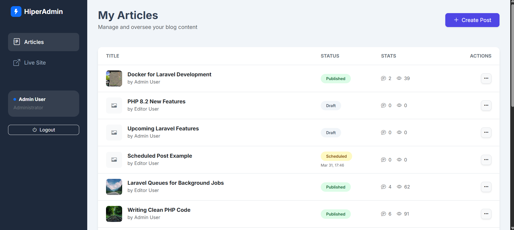
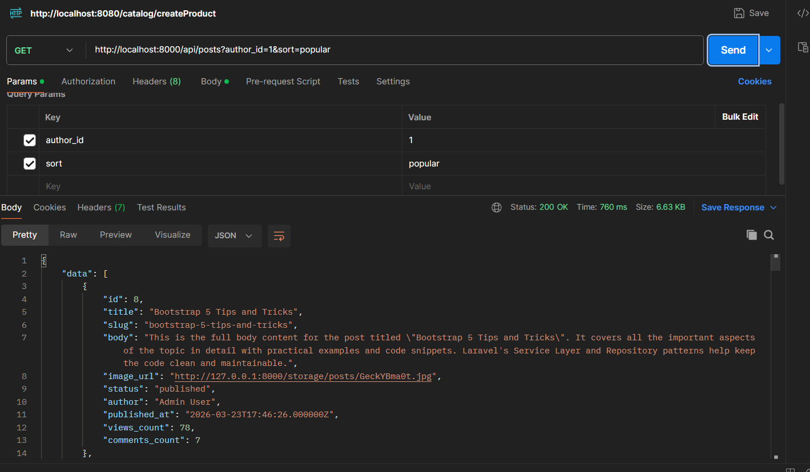
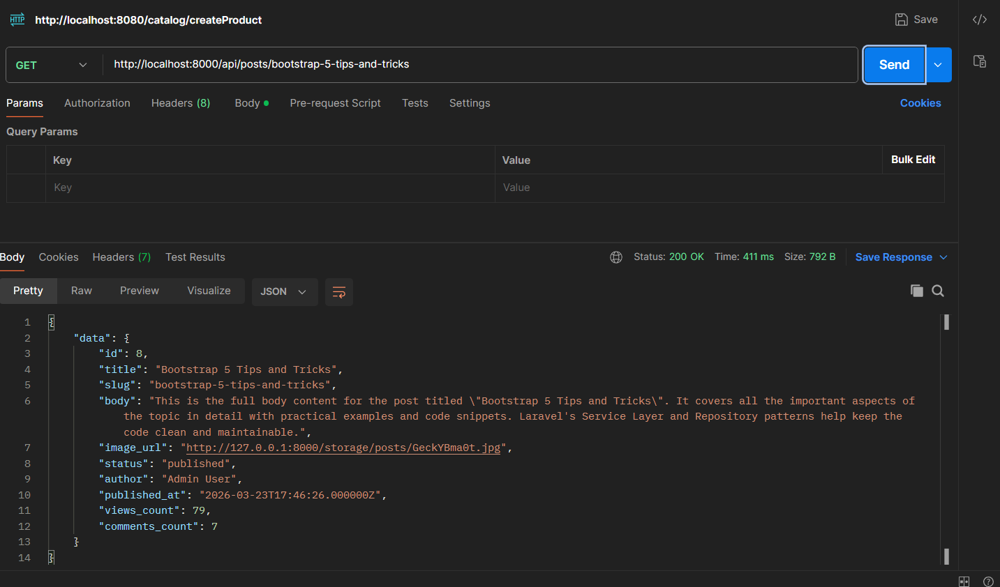
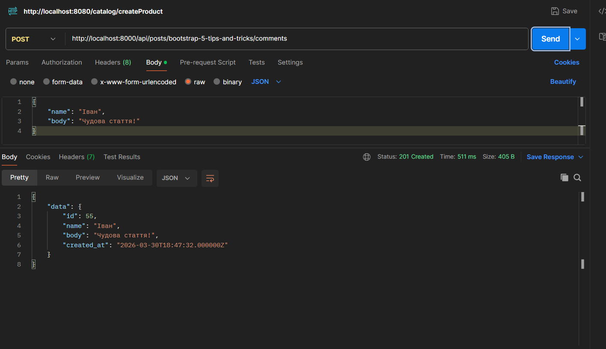

# HiperHost — Blog Engine

[]
(https://github.com/Andrew1256/Hiper_host)

editor: editor@blog.com
password: password

admin: admin@blog.com
password: password

Сучасний двигун для блогу на базі Laravel, побудований з використанням найкращих практик розробки (Service-Repository-DTO, Clean Architecture).

## 🚀 Інструкція запуску

Щоб запустити проект локально, виконайте наступні кроки:

1.  **Клонуйте репозиторій та перейдіть у папку:**
    ```bash
    git clone [url-репозиторію]
    cd Hiper_host
    ```

2.  **Встановіть PHP залежності:**
    ```bash
    composer install
    ```

3.  **Налаштуйте середовище:**
    ```bash
    cp .env.example .env
    # Налаштуйте підключення до бази даних у файлі .env (DB_DATABASE, DB_USERNAME, DB_PASSWORD)
    ```

4.  **Згенеруйте ключ додатка:**
    ```bash
    php artisan key:generate
    ```

5.  **Запустіть міграції та наповніть базу даними:**
    ```bash
    php artisan migrate --seed
    ```

6.  **Встановіть та зберіть фронтенд залежності:**
    ```bash
    npm install
    npm run dev
    ```

7.  **Запустіть локальний сервер:**
    ```bash
    php artisan serve
    ```

---

## 🔐 Облікові дані (Seeds)

Після запуску міграцій з сідами (`php artisan migrate --seed`), ви можете використовувати наступні дані для входу:

### Адміністратор (Admin)
- **Email**: `admin@blog.com`
- **Password**: `password`

### Редактор (Editor)
- **Email**: `editor@blog.com`
- **Password**: `password`

---

## 🏛️ Архітектурні рішення

Проект реалізовано за допомогою багатошарової архітектури для максимальної гнучкості та тестування:

*   **Service-Repository-DTO**:
    *   **DTO (Data Transfer Objects)**: Використовуються для передачі типізованих даних між шарами, уникаючи прямої передачі масивів або екземплярів Request.
    *   **Services**: Містять бізнес-логіку додатка (наприклад, обробку зображень, валідацію статусів публікації).
    *   **Repositories**: Відповідають виключно за взаємодію з базою даних через Eloquent, що дозволяє легко замінити джерело даних у майбутньому.
*   **FormRequests**: Вся валідація вхідних даних винесена в окремі класи для чистоти контролерів.
*   **Events/Listeners**: Такі дії, як оновлення лічильників коментарів або інвалідація кешу, відбуваються асинхронно через події.

---

## 🔒 Запобігання Race Condition

Для забезпечення цілісності даних при великих навантаженнях впроваджено наступні механізми:

1.  **Лічильник переглядів (Views Count)**:
    *   Використовується атомарна операція `Cache::add()` для обмеження накрутки (1 перегляд з одного IP раз на 60 секунд). Це запобігає стану гонки, коли декілька запитів одночасно намагаються перевірити наявність запису в кеші.
    *   Оновлення в БД виконується через SQL-запит `UPDATE posts SET views_count = views_count + 1`, що є атомарним на рівні СУБД.
2.  **Лічильник коментарів**: Оновлюється через `increment()` в репозиторії, що гарантує коректне значення навіть при паралельних запитах.

---

## 📊 База даних та Індекси

Ми збалансували структуру БД для швидкого пошуку та сортування:

*   **`status` + `published_at` + `publish_at`**:
    *   Додано індекси для фільтрації лише опублікованих постів.
    *   **Композитний індекс `['status', 'publish_at']`**: Створений спеціально для планувальника завдань (Scheduler), який щохвилини перевіряє пости для публікації.
*   **`views_count` та `comments_count`**: Індексовано для миттєвого сортування "найпопулярніших" та "найбільш обговорюваних" статей.
*   **`slug`**: Унікальний індекс для швидкого пошуку посту в API та на фронтенді.

---

## ⚡ Кешування та Інвалідація

Для зниження навантаження на БД використовується дворівневе кешування:

*   **Що кешується**:
    *   Список "ТОП-5 обговорюваних постів" у сайдбарі (`top_commented_posts`).
    *   Результати складних SQL-запитів для аналітики.
*   **Час життя (TTL)**: 5 хвилин (300 секунд) як базовий захист від "cache stampede".
*   **Інвалідація**: Кеш автоматично очищується лісенером `IncrementCommentCount` при створенні нового коментаря. Це гарантує актуальність даних у сайдбарі відразу після активності користувачів.

---

## 🌐 API Ендпоінти

Проект надає наступні API для інтеграції:

### 1. Отримання списку статей
`GET /api/posts`
- **Підказка**: Підтримує фільтрацію за автором та сортування.
- **Приклад CURL**:
```bash
curl -X GET "http://localhost:8000/api/posts?author_id=1&sort=popular" -H "Accept: application/json"
```


### 2. Деталі статті
`GET /api/posts/{slug}`
- **Приклад CURL**:
```bash
curl -X GET "http://localhost:8000/api/posts/my-first-post" -H "Accept: application/json"
```


### 3. Додавання коментаря
`POST /api/posts/{slug}/comments`
- **Приклад CURL**:
```bash
curl -X POST "http://localhost:8000/api/posts/my-first-post/comments" \
     -H "Content-Type: application/json" \
     -H "Accept: application/json" \
     -d '{"author_name": "Іван", "body": "Чудова стаття!"}'
```

> [!TIP]
> **Postman Колекція**: Ви можете імпортувати ці CURL команди безпосередньо в Postman або створити нову колекцію, додавши базовий URL `http://localhost:8000/api`.
